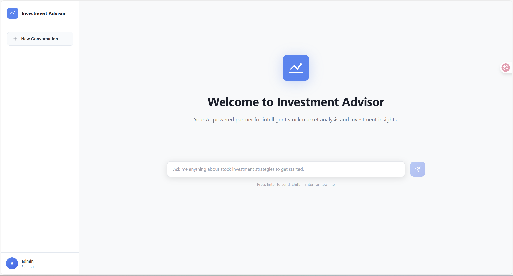

# NUS-stock-investment-agent

## SECTION 1 : PROJECT TITLE
A-share Investment Agent

## SECTION 2 : EXECUTIVE SUMMARY / PAPER ABSTRACT
* In real secondary stock markets, private investors often face challenges in making appropriate decisions to get their expected earnings
due to multiple reasons:
  1. **Lack of instant knowledge in stock markets**
     * it's hard for private investors to keep up with the fast-changing factors that influence stock prices, such as market news, economic indicators, and company performance.
     * Private investors is inclined to be affected by the market hype and other inappropriate factors, leading to irrational investment decisions.
  2. **Internal behavioral flaws in every private investor**
     * Private investors are inclined to make investment based on emotions, biases, and herd mentality rather than professional analysis.
     * Emotional reactions to market fluctuations can result in impulsive selling, rather than following a well-thought-out and long-term investment strategy.
  3. **Limited personal capacity**
     * Private investors often lack the time, resources, and expertise to conduct thorough research and analysis of stocks, compared with other professional financial institutions.
* To address these challenges, we have developed an LLM-powered investment agent, simulating professionals' behaviors in secondary stock markets, to assist users in automating their investment strategies and stock trading activities. 
If the agent get a user's investment profile, including investment goal and risk tolerance, it can help the user to make investment decisions and execute trades on their behalf t achieve the expected earnings.

## SECTION 3 : CREDITS / PROJECT CONTRIBUTION
| Official Full Name | Student ID | Work Items                                      | Email         |
|--------------------|-------------------------------|-------------------------------------------------|--------------------------|
| Zhang Yufei        | A0328587L                     | System design and implementation                | E1547342@u.nus.edu     |
| ZHANG ZEYU       | A0328897A                     | agent tools design and implemention             | E1553224@u.nus.edu      |
| TANG Yutong       | A0330149L                     | Long-term Memory and Full-Stack Web Application | e1554476@u.nus.edu    |
| CHEN JINGHAO        | A0329642Y                    | implement short term memory                     | e1553969@u.nus.edu      |
| Jeanette Lim       | A1234567E                     | xxxxxxxxxxx yyyyyyyyyyy zzzzzzzzzzz             | A1234567E@qq.com         |

## SECTION 4 : VIDEO OF SYSTEM MODELLING & USE CASE DEMO
[ab196b71da77bf6ad985acbe37140db9.mp4](Resource/ab196b71da77bf6ad985acbe37140db9.mp4)
## SECTION 5 : USER GUIDE
* clone repository to local by ```git clone https://github.com/Yu-fei-Zhang/NUS-stock-investment-agent.git```
* Install dependencies by ```pip install -r requirements.txt```
* Run the main script by ```python stock_agent/agent/agent.py```

## SECTION 6 : PROJECT REPORT / PAPER
* Executive Summary / Paper Abstract
* Sponsor Company Introduction (if applicable)
* Business Problem Background
* Market Research
* Project Objectives & Success Measurements
* Project Solution (To detail domain modelling & system design.)
* Project Implementation (To detail system development & testing approach.)
* Project Performance & Validation (To prove project objectives are met.)
* Project Conclusions: Findings & Recommendation
* Appendix of report: Project Proposal
* Appendix of report: Mapped System Functionalities against knowledge, techniques and skills of modular courses: MR, RS, CGS
* Appendix of report: Installation and User Guide
* Appendix of report: 1-2 pages individual project report per project member, including: Individual reflection of project journey: (1) personal contribution to group project (2) what learnt is most useful for you (3) how you can apply the knowledge and skills in other situations or your workplaces
* Appendix of report: List of Abbreviations (if applicable)
* Appendix of report: References (if applicable)
## SECTION 7 : MISCELLANEOUS
Refer to Github Folder: Resource
