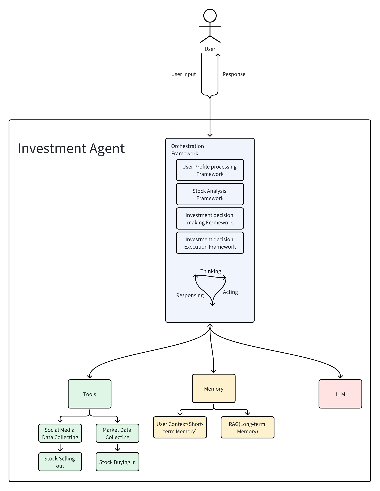

# NUS-stock-investment-agent

## Background
* In real secondary stock markets, private investors often face challenges in making appropriate decisions to get their expected earnings
due to multiple reasons:
  1. **Lack of instant knowledge in stock markets**
     * it's hard for private investors to keep up with the fast-changing factors that influence stock prices, such as market news, economic indicators, and company performance.
     * Private investors is inclined to be affected by the market hype and other inappropriate factors, leading to irrational investment decisions.
  2. **Internal behavioral flaws in every private investor**
     * Private investors are inclined to make investment based on emotions, biases, and herd mentality rather than professional analysis.
     * Emotional reactions to market fluctuations can result in impulsive selling, rather than following a well-thought-out and long-term investment strategy.
  3. **Limited personal capacity**
     * Private investors often lack the time, resources, and expertise to conduct thorough research and analysis of stocks, compared with other professional financial institutions.
* To address these challenges, we have developed an LLM-powered investment agent, simulating professionals' behaviors in secondary stock markets, to assist users in automating their investment strategies and stock trading activities. 
If the agent get a user's investment profile, including investment goal and risk tolerance, it can help the user to make investment decisions and execute trades on their behalf t achieve the expected earnings.

## System Design

  

* An agent system usually consists of four main components: Orchestration, LLM, Memory and Tools. We'll introduce each component in detail below.
* **Orchestration**: The orchestration component is responsible for managing the overall workflow of the agent system. It coordinates the interactions between the LLM, memory, and tools to ensure that the agent can effectively process user inputs and generate appropriate responses. 
* **LLM**: The LLM component is the core of the agent system. It utilizes a large language model to understand and generate human-like text based on the input it receives. The LLM is responsible for interpreting user queries, generating responses, and making decisions based on the information available in memory and through tools.
* **Memory**: The memory component stores relevant information that the agent can use to inform its decisions and responses. This can include user profiles, historical data, and any other context that may be useful for the agent to reference when interacting with users.
* **Tools**: The tools component provides the agent with access to external resources and functionalities that can enhance its capabilities. This can include APIs for retrieving real-time stock data, executing trades, and performing technical analysis.

