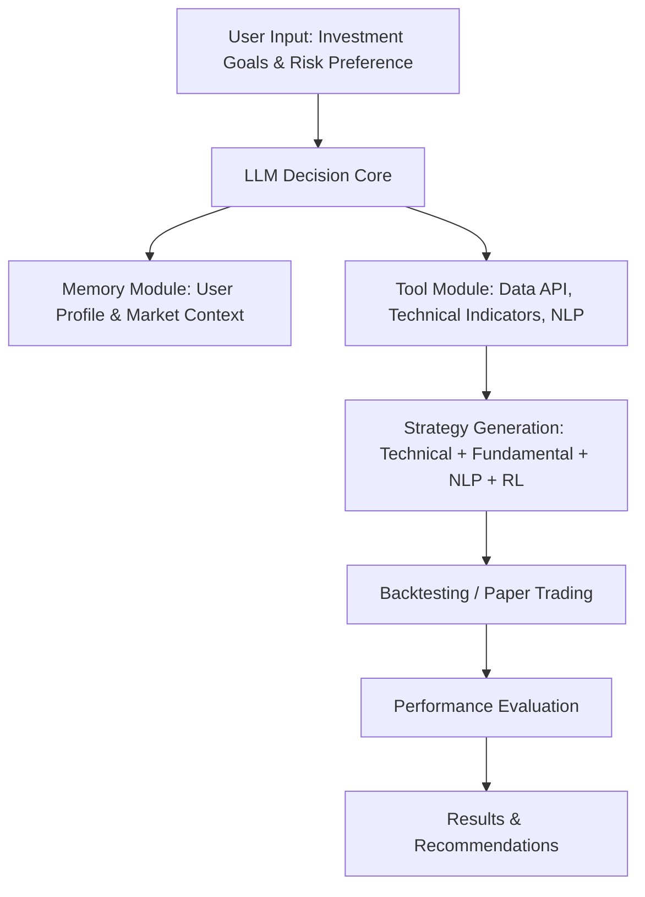

# Proposal: A-Share Intelligent Trading Agent (Part 4)

## 4. Methodology

### 4.1 Data Sources

To ensure authenticity and validity, the system will use multi-channel A-share market data:

- **Market Data**  
  - Daily, minute-level, and tick-by-tick trading data (sources: Tushare Pro, Eastmoney API, Wind).  
  - Includes open, close, high, low prices, volume, and percentage changes.  
  - Tick-level data allows modeling microstructure effects, such as order flow imbalance and intraday volatility.

- **Fundamental Data**  
  - Financial statements of listed companies (balance sheet, income statement, cash flow).  
  - Industry classification and index performance for peer comparison.  
  - Company announcements and regular reports (CNINFO, SSE/SZSE announcements) to detect significant corporate events like dividends, M&A, or earnings surprises.

- **News & Policy Information**  
  - Regulatory policies and announcements (CSRC, exchanges).  
  - Market news and public sentiment (Sina Finance, Xueqiu community).  
  - Sentiment analysis of news using Natural Language Processing (NLP), which assigns scores to assess market perception and potential price impact [3].  

- **User Inputs**  
  - Investment objectives (maximize returns, risk control, stable growth).  
  - Risk preference (conservative, neutral, aggressive).  
  - These inputs influence position sizing, portfolio allocation, and the aggressiveness of trading actions.

---

### 4.2 Algorithm Framework

The system integrates multiple analysis methods to form a **multi-modal decision framework**, leveraging technical indicators, fundamental analysis, sentiment analysis, and reinforcement learning.

#### (1) Technical Analysis Module

- **Indicator Calculation**  
  - **MA/EMA**: Identify short-term and long-term trends. EMA gives higher weight to recent prices, making it more sensitive to recent movements.  
  - **MACD**: Uses the difference between fast and slow EMAs to detect momentum and potential trend reversals.  
  - **RSI**: Measures the strength of recent price movements to detect overbought or oversold conditions.  
  - **Bollinger Bands**: Identify periods of high or low volatility and potential breakout points.

- **Pattern Recognition**  
  - CNNs are trained on historical K-line charts to automatically detect formations like Head & Shoulders, Double Tops/Bottoms, or Engulfing patterns, which often precede price reversals [6].  

- **Trend Prediction**  
  - **ARIMA model**: Well-suited for linear, stationary price series, captures autocorrelation patterns for short-term forecasts.  
  - **LSTM networks**: Capture nonlinear dependencies and long-term memory in stock price series, allowing prediction of future prices considering past trends and volatility patterns [1].  

#### (2) Fundamental Analysis Module

- **Financial Health Scoring**  
  - Quantify the company's profitability, leverage, and efficiency using ROE, net profit margin, and debt-to-asset ratio.  
  - Aggregate into a composite financial health score to rank companies.

- **Industry Outlook Analysis**  
  - Compare company's valuation (PE, PB) with industry averages to identify overvalued or undervalued stocks.  
  - Incorporate macroeconomic indicators and sector growth trends for context.

- **Growth Evaluation**  
  - Fit historical revenue, earnings, and cash flow data using linear or nonlinear regression models.  
  - Project growth trends and potential market capitalization expansion.

#### (3) Natural Language Processing Module

- **News and Announcement Sentiment Analysis**  
  - Pre-trained models like FinBERT classify news as positive, neutral, or negative to infer potential price movements [3].  
  - Sentiment scores are normalized and combined with technical signals to guide buy/sell decisions.

- **Keyword Extraction**  
  - Detect terms like “policy support,” “earnings upgrade,” “share reduction,” “regulatory penalty,” which may indicate abnormal trading opportunities or risks.

- **LLM Summarization**  
  - Large Language Models condense lengthy financial reports into actionable signals, enabling faster decision-making without losing critical information.

#### (4) Reinforcement Learning and Strategy Optimization

- **Reinforcement Learning Methods**  
  - **Deep Q-Network (DQN)**: Approximates Q-values for discrete action spaces (buy, sell, hold), learning optimal policies from historical market states [2].  
  - **Policy Gradient / Actor-Critic**: Handles continuous action spaces such as fractional position sizing; optimizes policies directly.  
  - **Multi-Agent RL**: Simulates multiple market participants to capture interactions and emergent market behaviors, improving strategy robustness [4].  

- **Reward Function Design**  
  - Reward combines realized returns, risk-adjusted metrics (Sharpe ratio, Sortino ratio), and drawdown penalties [5].  
  - Encourages strategies that maximize return while controlling risk and volatility.

---

### 4.3 Experimental Design

1. **Historical Backtesting**  
   - Apply strategies to 5–10 years of historical A-share data.  
   - Include realistic constraints: slippage, transaction costs, margin requirements.  
   - Compare against benchmarks: CSI 300 Index, simple moving average strategies.  
   - Evaluate not just profitability but robustness across different market regimes (bull, bear, sideways).

2. **Paper Trading**  
   - Connect to live market feeds for simulated trading.  
   - Monitor 1–3 months to validate real-time performance, latency, and execution logic.  
   - Adjust strategies dynamically based on observed market microstructure effects.

3. **A/B Testing**  
   - Compare human investor decisions versus AI agent recommendations.  
   - Evaluate single-strategy approaches versus multi-modal decision-making combining technical, fundamental, NLP, and RL components.

---

### 4.4 Evaluation Metrics

- **Return Metrics**  
  - Portfolio return (ROI) and annualized return.  
  - Evaluate consistency of returns across multiple periods.

- **Risk Control**  
  - Maximum drawdown to measure downside risk.  
  - Sharpe ratio and Sortino ratio [7] for risk-adjusted performance evaluation.

- **System Performance**  
  - Latency from input to decision output to ensure practical usability.  
  - Explainability of decisions: the system should provide clear reasoning, e.g., which technical or sentiment signals triggered a trade.

- **Baseline Comparison**  
  - Compare against traditional strategies (moving average, momentum) and human investment performance to validate added value.

---

### 4.5 Research Flowchart

---
References

[1] Hochreiter, S., & Schmidhuber, J. (1997). Long Short-Term Memory. Neural Computation, 9(8), 1735–1780.

[2] Mnih, V., et al. (2015). Human-level control through deep reinforcement learning. Nature, 518(7540), 529–533.

[3] Araci, D. (2019). FinBERT: Financial Sentiment Analysis with Pre-trained Language Models. arXiv preprint arXiv:1908.10063.

[4] Yang, Y., et al. (2020). Deep Multi-Agent Reinforcement Learning for Stock Trading. IEEE Transactions on Neural Networks and Learning Systems.

[5] Chan, E., & Wong, W. (2021). Quantitative Trading: Algorithms, Analytics, Data, Models, Optimization. Wiley.

[6] Tsantekidis, A., et al. (2017). Forecasting Stock Prices from the Limit Order Book Using Convolutional Neural Networks. IEEE.

[7] Sharpe, W. F. (1994). The Sharpe Ratio. Journal of Portfolio Management, 21(1), 49–58.
